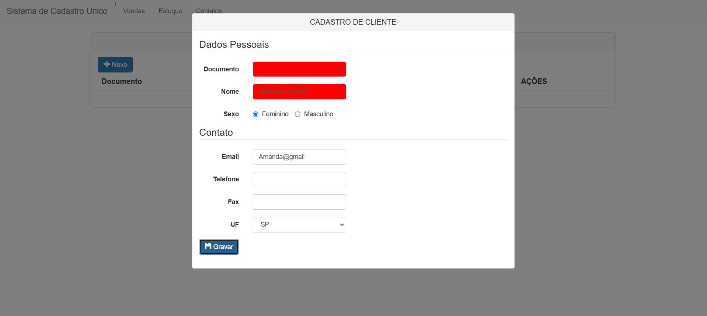
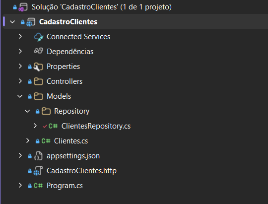

# Sistema de Cadastro de Clientes (CRUD)

> **Status do Projeto:** Em Desenvolvimento

Este é um projeto prático de desenvolvimento de um sistema corporativo para cadastro e gerenciamento de clientes. O objetivo principal é aplicar e consolidar conhecimentos em desenvolvimento Full-Stack, utilizando o ecossistema .NET no back-end e tecnologias web clássicas no front-end.

## Funcionalidades

**Front-end:**
- [x] Interface gráfica responsiva para listagem de clientes cadastrados.
- [x] Modal interativo para cadastro e edição de dados.
- [x] Validação visual de campos obrigatórios (ex: Documento e Nome).
- [x] Integração assíncrona com a API (consumo de endpoints via AJAX/jQuery).

**Back-end (Web API):**
- [x] Estruturação da API RESTful com rotas bem definidas (`[HttpGet]`, `[HttpPost]`, `[HttpDelete]`).
- [x] Implementação do padrão de arquitetura **Repository Pattern** para separação de responsabilidades.
- [x] Modelagem da entidade `Clientes`.
- [x] Listagem de dados mockados em memória para testes de integração com o front-end.
- [ ] Integração com Banco de Dados SQL Server (Implementação futura nos blocos try/catch).

## Fotos

### Interface da Aplicação Web
> *Visão do painel de clientes e do modal de cadastro.*

### Arquitetura do Projeto no Visual Studio
> *Organização em camadas separando Models, Controllers e Repository.*

## Tecnologias Utilizadas

**Front-end:**
* HTML5 e CSS3
* Bootstrap (Estilização e Componentes UI)
* JavaScript / jQuery e AJAX

**Back-end:**
* C#
* ASP.NET Core Web API
* Padrão Repository (Arquitetura)
